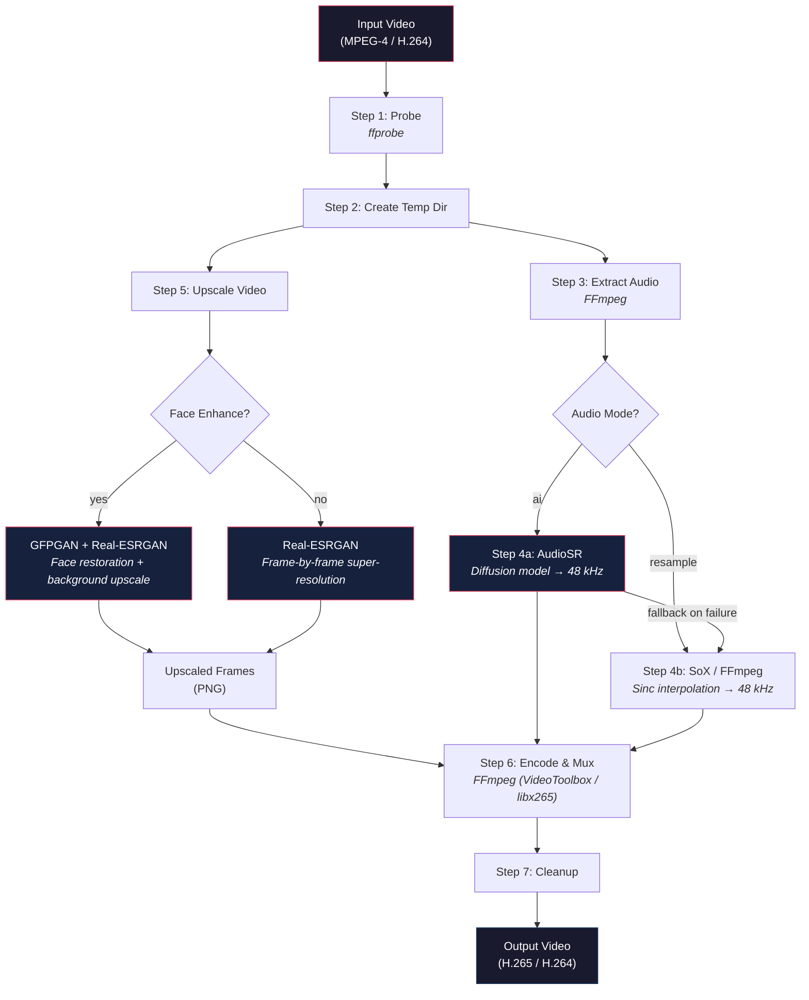
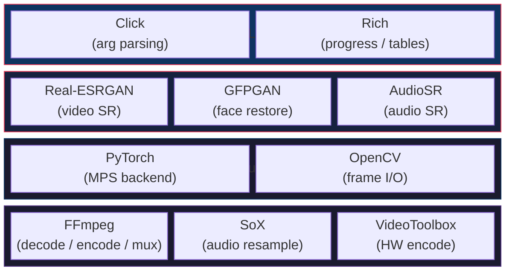
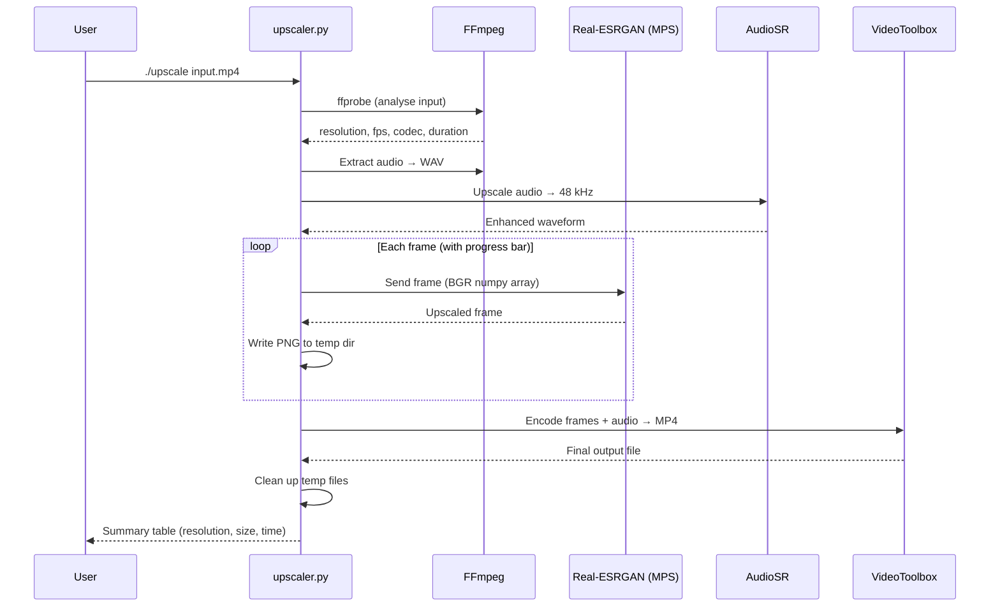

<p align="center">
  
</p>

<h1 align="center">Upscaler</h1>

A local-first CLI tool for AI-powered video and audio upscaling. Uses **Real-ESRGAN** for video super-resolution and **AudioSR** for audio super-resolution, with optional **GFPGAN** face enhancement. Optimised for Apple Silicon with Metal/MPS GPU acceleration.

All processing happens entirely on your machine — no uploads, no cloud services, no subscriptions.

## Features

- **AI video upscaling** via Real-ESRGAN (2x, 3x, or 4x)
- **AI audio upscaling** via AudioSR (reconstructs high-frequency content lost to compression)
- **Traditional audio resampling** via SoX / FFmpeg as a fast alternative
- **Face enhancement** via GFPGAN (restores facial detail in performers, speakers, etc.)
- **Hardware-accelerated encoding** via Apple VideoToolbox (H.265 / H.264)
- **MPS GPU acceleration** on Apple Silicon (M1–M4) for Real-ESRGAN inference
- Rich terminal UI with progress bars, ETA, and summary tables

## Architecture



### Component Stack



### Processing Pipeline Detail



## Requirements

- **macOS** with Apple Silicon (M1/M2/M3/M4) — also works on Intel (CPU-only, slower)
- **Homebrew** ([brew.sh](https://brew.sh))
- ~2 GB disk space for model weights (downloaded on first run)

## Installation

### Quick Setup

```bash
git clone <repo-url> && cd upscaler
./setup.sh
```

### Manual Setup

```bash
# System dependencies
brew install ffmpeg sox python@3.12

# Python environment
python3.12 -m venv .venv
source .venv/bin/activate
pip install --upgrade pip
pip install -r requirements.txt
```

### Verify Installation

```bash
./upscale --help
```

## Usage

### Basic

```bash
# Upscale video to 2x with AI audio (defaults)
./upscale ~/Downloads/video.mp4

# Specify output path
./upscale ~/Downloads/video.mp4 -o ~/Desktop/video_hd.mp4
```

### All Options

```
Usage: upscaler.py [OPTIONS] INPUT_PATH

Options:
  -o, --output PATH           Output file path [default: {input}_upscaled.mp4]
  -s, --scale [2|3|4]         Upscale factor [default: 2]
  --audio-mode [ai|resample]  Audio upscaling method [default: ai]
  --codec [h265|h264]         Output video codec [default: h265]
  --face-enhance              Enable GFPGAN face restoration
  --denoise FLOAT             Denoise strength 0.0-1.0 [default: 0.5]
  --help                      Show this message and exit.
```

### CLI Reference

| Flag | Default | Description |
|---|---|---|
| `-o, --output PATH` | `{input}_upscaled.mp4` | Output file path. If omitted, appends `_upscaled` to the input filename. |
| `-s, --scale [2\|3\|4]` | `2` | Upscale factor. `2` doubles resolution (e.g. 640x352 -> 1280x704), `4` quadruples it. `3` upscales at 4x internally then resizes down with Lanczos. |
| `--audio-mode [ai\|resample]` | `ai` | `ai` uses AudioSR (diffusion model) to reconstruct high-frequency audio content. `resample` uses SoX/FFmpeg for fast mathematical resampling. Both output 48 kHz. |
| `--codec [h265\|h264]` | `h265` | Output video codec. H.265 produces ~50% smaller files at the same quality. Both try hardware encoding (VideoToolbox) first, falling back to software (libx265/libx264). |
| `--face-enhance` | off | Enables GFPGAN face restoration. Useful for videos with people — restores facial features that AI upscaling alone may miss. |
| `--denoise FLOAT` | `0.5` | Denoise strength from 0.0 (none) to 1.0 (maximum). The Real-ESRGAN model handles moderate compression noise by default. |

### Examples

```bash
# Upscale a Qawwali performance to 720p with face enhancement
./upscale ~/Downloads/example.mp4 --face-enhance

# Fast upscale — skip AI audio, use traditional resampling
./upscale ~/Downloads/example.mp4 --audio-mode resample

# 4x upscale to ~1440p (takes longer, needs more memory)
./upscale ~/Downloads/example.mp4 -s 4

# Use H.264 for maximum player compatibility
./upscale ~/Downloads/example.mp4 --codec h264

# Custom output path with all options
./upscale ~/Downloads/example.mp4 \
  -o ~/Desktop/kaiser_hd.mp4 \
  -s 2 \
  --audio-mode ai \
  --codec h265 \
  --face-enhance

# Upscale with no denoising
./upscale ~/Downloads/concert.mp4 --denoise 0.0
```

## How It Works

### Video Upscaling (Real-ESRGAN)

Real-ESRGAN is a Generative Adversarial Network trained to reconstruct high-resolution detail from low-resolution input. Unlike traditional interpolation (bicubic, lanczos), it generates plausible texture, edges, and fine detail that did not exist in the source.

- **2x scale** uses the `RealESRGAN_x2plus` model (64MB)
- **3x/4x scale** uses the `realesrgan-x4plus` model (64MB)
- Frames are processed tile-by-tile (400px tiles) to fit in memory
- On Apple Silicon, inference runs on the GPU via PyTorch's MPS backend

### Audio Upscaling

**AI mode (AudioSR):** A diffusion-based generative model that predicts and synthesises high-frequency content that was lost during compression. It takes audio at any sample rate and outputs 48 kHz with reconstructed harmonics and overtones. Particularly effective for heavily compressed audio (64-128 kbps AAC/MP3).

**Resample mode (SoX/FFmpeg):** High-quality mathematical resampling using sinc interpolation. Fast and artifact-free, but does not add new frequency content — it only changes the sample rate. Best when the source audio is already high quality.

### Face Enhancement (GFPGAN)

GFPGAN is a face restoration model that works alongside Real-ESRGAN. When enabled, it detects faces in each frame, restores facial features (eyes, mouth, skin texture), and composites the enhanced face back onto the Real-ESRGAN-upscaled background. Useful for performance videos, interviews, and any content with visible faces.

## Estimated Processing Times

For an 11-minute video at 30fps (~20,000 frames) on Apple M4:

| Scale | Output Resolution | Estimated Time |
|---|---|---|
| 2x | 1280x704 | 20–40 minutes |
| 3x | 1920x1056 | 40–80 minutes |
| 4x | 2560x1408 | 60–120 minutes |

Times vary based on content complexity, tile count, and whether face enhancement is enabled. AI audio upscaling adds a few extra minutes.

## Troubleshooting

### Out of memory

If you see memory errors during upscaling, the 400px tile size may be too large for your available RAM at higher scale factors. This is most likely with `--scale 4` on machines with 8GB RAM.

### AudioSR not available

AudioSR has strict dependency requirements. If it fails to import, the tool automatically falls back to SoX resampling. You can also skip it entirely with `--audio-mode resample`.

### Slow processing

- Ensure MPS is being used (the tool prints "Using Metal/MPS GPU acceleration" at startup)
- Close other GPU-intensive applications
- Use `--scale 2` instead of `4` for a good quality-to-speed balance
- Use `--audio-mode resample` to skip the slower AI audio step

### Hardware encoder fails

If VideoToolbox encoding fails (rare), the tool automatically falls back to software encoding (libx265/libx264). Software encoding is slower but always available.

## Project Structure

```
upscaler/
├── upscaler.py        # Main CLI tool — all pipeline logic
├── upscale            # Shell wrapper (activates venv, runs upscaler.py)
├── setup.sh           # One-time setup script
├── requirements.txt   # Python dependencies
└── .venv/             # Python virtual environment (created by setup.sh)
```

## License

MIT
